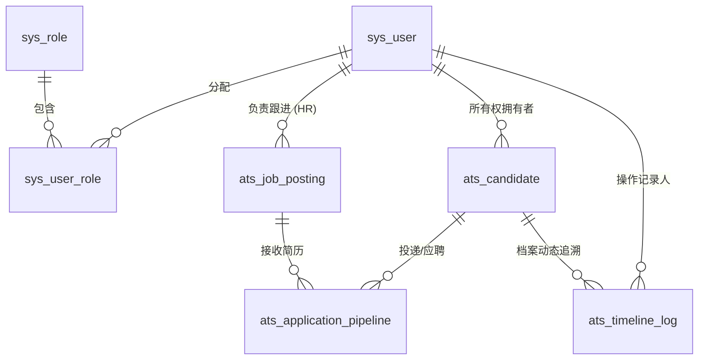

# 乐跳 ATS 数据字典与 ER 建模 (V1.0)

本文档定义了乐跳招聘管理系统（纯内用版）的底层核心表结构。考虑到系统采用了基于 `.NET 8 Dapper` 的微 ORM 架构，以下模型高度遵循实体隔离（扁平化）原则，并利用了 MySQL 的 JSON 类型保留候选人复杂履历扩展能力。

## 一、 实体关系图 (Entity Relationship Diagram)



## 二、 核心数据模型 (SQL Schema)

> **注：** 以下为基础 DDL 语句，使用 `InnoDB` 引擎和 `utf8mb4` 字符集，保障了中生代解析引擎生成偏僻字的兼容要求。所有时间字段约定框架默认使用 UTC 落库或统一部署区时区。

### 1. 系统与权限底座表 (RBAC)

#### `sys_user` (系统用户表)
用于存储登录本系统的企业内部员工（HR、用人经理、管理层等）。
```sql
CREATE TABLE `sys_user` (
  `id` INT NOT NULL AUTO_INCREMENT,
  `username` VARCHAR(50) NOT NULL COMMENT '登录账号 (手机号/工号)',
  `password_hash` VARCHAR(255) NOT NULL,
  `real_name` VARCHAR(50) NOT NULL COMMENT '真实姓名',
  `department_name` VARCHAR(100) NULL COMMENT '所属部门名称(冗余)',
  `status` TINYINT(1) DEFAULT 1 COMMENT '1-正常使用, 0-禁用/离职',
  `created_at` DATETIME DEFAULT CURRENT_TIMESTAMP,
  `updated_at` DATETIME DEFAULT CURRENT_TIMESTAMP ON UPDATE CURRENT_TIMESTAMP,
  PRIMARY KEY (`id`),
  UNIQUE KEY `uk_username` (`username`)
) ENGINE=InnoDB DEFAULT CHARSET=utf8mb4 COMMENT='系统账号表';
```

#### `sys_role` & `sys_user_role` (角色池与绑定记录)
```sql
CREATE TABLE `sys_role` (
  `id` INT NOT NULL AUTO_INCREMENT,
  `role_name` VARCHAR(50) NOT NULL COMMENT '显示名称(如: 高级HR, 用人经理)',
  `role_code` VARCHAR(50) NOT NULL COMMENT '程序识别码(如: ROLE_HR)',
  PRIMARY KEY (`id`),
  UNIQUE KEY `uk_role_code` (`role_code`)
) ENGINE=InnoDB DEFAULT CHARSET=utf8mb4 COMMENT='角色字典表';

CREATE TABLE `sys_user_role` (
  `user_id` INT NOT NULL,
  `role_id` INT NOT NULL,
  PRIMARY KEY (`user_id`, `role_id`)
) ENGINE=InnoDB DEFAULT CHARSET=utf8mb4 COMMENT='用户角色绑定表';
```

---

### 2. 人才资产与工作流流转核心表

#### `ats_candidate` (人才候选人底表)
候选人档案是系统的核心资产池（包含由于各种原因沉淀的私海/公海简历）。
```sql
CREATE TABLE `ats_candidate` (
  `id` INT NOT NULL AUTO_INCREMENT,
  `name` VARCHAR(50) NOT NULL COMMENT '候选人姓名',
  `phone` VARCHAR(20) NOT NULL COMMENT '绑定手机号(全系统强校验查重)',
  `email` VARCHAR(100) DEFAULT NULL COMMENT '邮箱',
  `gender` TINYINT(1) DEFAULT 0 COMMENT '0-未知, 1-男, 2-女',
  `highest_degree` VARCHAR(20) DEFAULT NULL COMMENT '最高学历 (如: 本科, 硕士)',
  `work_years` INT DEFAULT 0 COMMENT '工作年限',
  
  `resume_file_url` VARCHAR(255) DEFAULT NULL COMMENT 'OSS/文件系统中原始简历PDF的路径',
  `ai_parsed_data` JSON DEFAULT NULL COMMENT 'JSON格式：AI解析出的全量履历信息',
  
  `owner_id` INT DEFAULT NULL COMMENT '当前所属HR(私有池)。掉入公海则为NULL',
  `last_follow_time` DATETIME DEFAULT CURRENT_TIMESTAMP COMMENT '最后跟进时间(用于算公海阈值)',
  `created_at` DATETIME DEFAULT CURRENT_TIMESTAMP,
  `updated_at` DATETIME DEFAULT CURRENT_TIMESTAMP ON UPDATE CURRENT_TIMESTAMP,
  PRIMARY KEY (`id`),
  UNIQUE KEY `uk_phone` (`phone`),
  INDEX `idx_owner` (`owner_id`)
) ENGINE=InnoDB DEFAULT CHARSET=utf8mb4 COMMENT='系统候选人底模表';
```

#### `ats_job_posting` (职位/需求发布表)
```sql
CREATE TABLE `ats_job_posting` (
  `id` INT NOT NULL AUTO_INCREMENT,
  `title` VARCHAR(100) NOT NULL COMMENT '职位名称',
  `department_name` VARCHAR(100) NOT NULL COMMENT '用人部门',
  `city` VARCHAR(50) NOT NULL COMMENT '工作地',
  `headcount_target` INT DEFAULT 1 COMMENT '拟招聘预算编制人数',
  `min_salary` INT DEFAULT 0 COMMENT '薪资底位区间(千)',
  `max_salary` INT DEFAULT 0 COMMENT '薪资高位区间(千)',
  `description` TEXT NOT NULL COMMENT 'JD详情',
  
  `status` VARCHAR(20) DEFAULT 'PUBLISHED' COMMENT 'DRAFT-草稿, PUBLISHED-开放中, PAUSED-暂停, CLOSED-已关停',
  `hr_owner_id` INT NOT NULL COMMENT '主跟HR负责人',
  `created_at` DATETIME DEFAULT CURRENT_TIMESTAMP,
  `updated_at` DATETIME DEFAULT CURRENT_TIMESTAMP ON UPDATE CURRENT_TIMESTAMP,
  PRIMARY KEY (`id`),
  INDEX `idx_status` (`status`)
) ENGINE=InnoDB DEFAULT CHARSET=utf8mb4 COMMENT='职位实体表';
```

#### `ats_application_pipeline` (招聘生命周期流转表) 🚨 核心表
一张极度重要的“桥接表”，它记录了一名特定的“候选人”参与某个“职位”招聘过程时，当前推进到的节点坐标。
```sql
CREATE TABLE `ats_application_pipeline` (
  `id` INT NOT NULL AUTO_INCREMENT,
  `candidate_id` INT NOT NULL COMMENT '关联候选人',
  `job_id` INT NOT NULL COMMENT '关联职位',
  
  `current_stage` VARCHAR(50) NOT NULL COMMENT '所处环节：SCREENING-初筛, BIZ_REVIEW-复筛, INTERVIEW-面试, BG_CHECK-背调, OFFER, ONBOARDED-入职',
  `is_eliminated` TINYINT(1) DEFAULT 0 COMMENT '是否已在该岗位落榜/被淘汰',
  `elimination_reason` VARCHAR(255) DEFAULT NULL COMMENT '如果淘汰，对应的原因字典',
  
  `status_changed_at` DATETIME DEFAULT CURRENT_TIMESTAMP COMMENT '节点跃迁进入时间点',
  `created_at` DATETIME DEFAULT CURRENT_TIMESTAMP,
  `updated_at` DATETIME DEFAULT CURRENT_TIMESTAMP ON UPDATE CURRENT_TIMESTAMP,
  PRIMARY KEY (`id`),
  UNIQUE KEY `uk_candidate_job` (`candidate_id`, `job_id`) COMMENT '确保同一职位只有一条活跃pipeline',
  INDEX `idx_stage` (`job_id`, `current_stage`, `is_eliminated`) COMMENT 'Kanban面板拉取黄金索引'
) ENGINE=InnoDB DEFAULT CHARSET=utf8mb4 COMMENT='候选人阶段推进记录(Kanban骨架)';
```

#### `ats_timeline_log` (全景档案时间轴记录表)
所有操作事件（发送短信、自动退回公海、HR手写便签留言）都必须追加（Append-only）到此表，展示在候选人的全息履历卡上。
```sql
CREATE TABLE `ats_timeline_log` (
  `id` BIGINT NOT NULL AUTO_INCREMENT,
  `candidate_id` INT NOT NULL COMMENT '此记录挂靠在哪位候选人下',
  `application_id` INT DEFAULT NULL COMMENT '如果是岗位阶段性动作（像发offer），填对应的流转ID',
  `operator_id` INT DEFAULT NULL COMMENT '产生该记录的操作人（如果是系统调度器则为NULL）',
  
  `action_type` VARCHAR(50) NOT NULL COMMENT '事件类目: SYS_AUTO, HR_MEMO, STAGE_MOVE',
  `content` TEXT NOT NULL COMMENT '记录详情/备注内容全文',
  `created_at` DATETIME DEFAULT CURRENT_TIMESTAMP,
  PRIMARY KEY (`id`),
  INDEX `idx_candidate_time` (`candidate_id`, `created_at` DESC) COMMENT '候选人详情页时间线拉取'
) ENGINE=InnoDB DEFAULT CHARSET=utf8mb4 COMMENT='全局候选人跟进/沟通历史溯源轴';
```
